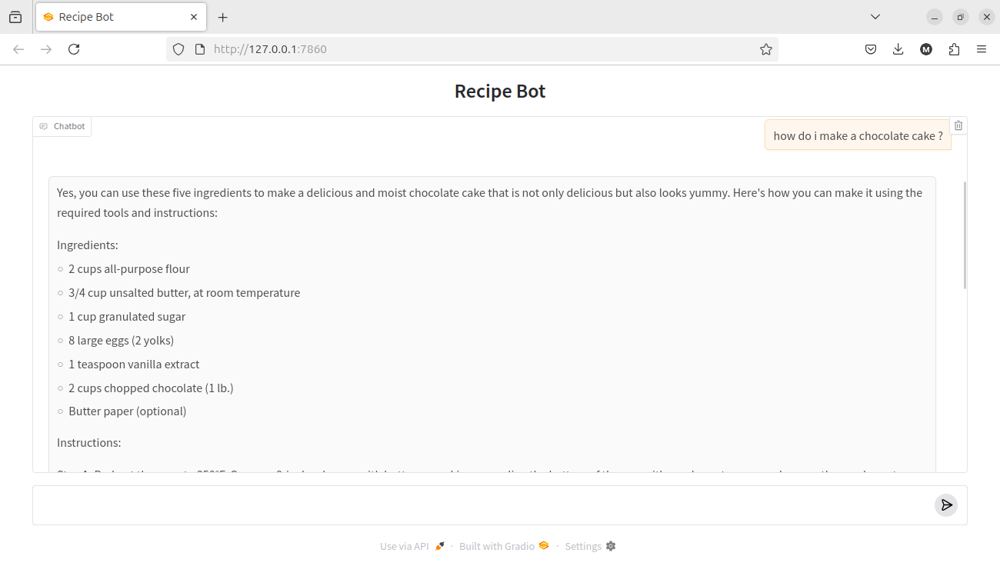

# RecipeQA Bot

## Description

Ce projet implémente un chatbot utilisant le modèle `tinyllama` pour répondre à des questions concernant des recettes. Le chatbot est basé sur le jeu de données **RecipeQA** provenant de [ce lien](https://hucvl.github.io/recipeqa/). Le modèle permet de répondre aux questions en se basant sur les étapes des recettes, mais les résultats peuvent être améliorés pour obtenir des formulations plus précises.

## Prérequis

- Python 3.x
- `virtualenv` (recommandé pour une gestion propre de l'environnement virtuel)

## Installation

1. Clone ce repository sur ta machine :
   ```bash
   git clone https://github.com/ton-utilisateur/ton-repository.git
   cd ton-repository
   ```

2. Crée un environnement virtuel :
   ```bash
   python -m venv venv
   source venv/bin/activate  
   ```

3. Installe les dépendances depuis le fichier `requirements.txt` :
   ```bash
   pip install -r requirements.txt
   ```

4. **Problème d'installation de `sentence-transformers` ?**  
   Si tu rencontres des problèmes avec l'installation de `sentence-transformers`, c'est probablement dû à un problème avec `torch` (une dépendance de `sentence-transformers`). Assure-toi que `torch` est bien installé en suivant les instructions sur [le site officiel de PyTorch](https://pytorch.org/get-started/locally/).

## Dataset

Le dataset utilisé pour ce projet provient de [RecipeQA](https://hucvl.github.io/recipeqa/). Comme ce dataset est trop volumineux pour être poussé sur GitHub, il est nécessaire de le télécharger séparément et de le placer dans le dossier `datasets`.

- Télécharge le dataset depuis [ici](https://hucvl.github.io/recipeqa/).
- Décompresse-le et place-le dans le dossier `datasets` de ton projet.

**Structure attendue du dataset** :  
Le fichier `train.json` contient des données de recettes au format JSON, qui sont utilisées pour entraîner et interroger le modèle.

## Lancer l'application

1. Lance l'application en exécutant le fichier `app.py` :
   ```bash
   python app.py
   ```

2. Une fois l'application lancée, tu peux interagir avec le chatbot via une interface Gradio.

## Docker

Le projet inclut également un fichier `Dockerfile`. Bien qu'il n'ait pas été testé, il est censé fonctionner pour dockeriser l'application. Pour créer l'image Docker, exécute :

```bash
docker build -t recipeqa-bot .
docker run -p 7860:7860 recipeqa-bot
```

Cela lancera l'interface Gradio dans un container Docker.

## Exemple de Résultat



## Limitations

- **Limite de performance** : Le modèle `tinyllama` a été choisi en raison de contraintes matérielles (problèmes de RAM ou d'espace disque pour utiliser `llama2`).
- **Précision des réponses** : Les résultats ne sont pas parfaits, surtout pour des recettes ou des formulations que le modèle n'a pas rencontrées dans le dataset. Les formulations des réponses peuvent ne pas être totalement correctes, mais elles sont généralement acceptables pour des recettes connues dans le dataset.

## Concepts GenAI Appliqués dans ce Projet

### 1. RAG (Retrieval-Augmented Generation)
Combinaison d'un système de recherche (vecteurs) et d'un LLM pour générer des réponses précises.

Dans le projet :
- **ChromaDB** recherche les recettes pertinentes.
- **TinyLlama** génère des réponses basées sur ces recettes.

**Exemple** :  
Pour la question "Comment faire une pâte à pizza ?", le système :
- Trouve les étapes de recettes similaires.
- Formule une réponse naturelle en s'appuyant sur ces étapes.

### 2. Embeddings et Recherche Sémantique
Conversion du texte en vecteurs numériques pour comprendre le sens.

Dans le projet :
- **all-MiniLM-L6-v2** transforme les recettes en vecteurs.
- Permet de trouver "gluten free cake" même si la requête est "recette gâteau sans gluten".
- Technique : Similarité cosinus entre vecteurs.

### 3. Optimisation de LLM Local
Exécution de modèles sur machine personnelle.

Dans le projet :
- Choix de **TinyLlama** pour une faible consommation RAM et une rapidité d'inférence.
- Alternative à **Llama2/GPU coûteux**.

### 4. Prompt Engineering
Guidage du LLM via des instructions spécifiques.

Dans le projet :
- Le prompt implicite est :  
  "Réponds à la question en utilisant uniquement ces étapes de recettes : {chunks}"
- Évite les hallucinations en limitant le contexte.

## Structure du Projet

- **`app.py`** : Fichier principal pour lancer l'application Gradio.
- **`main.py`** : Contient la logique principale pour interagir avec le modèle et récupérer les réponses.
- **`Dockerfile`** : Permet de dockeriser l'application.
- **`requirements.txt`** : Liste des dépendances nécessaires au projet.
- **`datasets/`** : Dossier contenant le dataset `train.json` (à ne pas pousser sur GitHub).
- **`gitignore`** : Liste les fichiers et dossiers à ignorer par Git.
- **`LICENSE`** : Licence du projet.
- **`README.md`** : Ce fichier de documentation.

## Licence

Ce projet est sous licence MIT. Consulte le fichier `LICENSE` pour plus de détails.